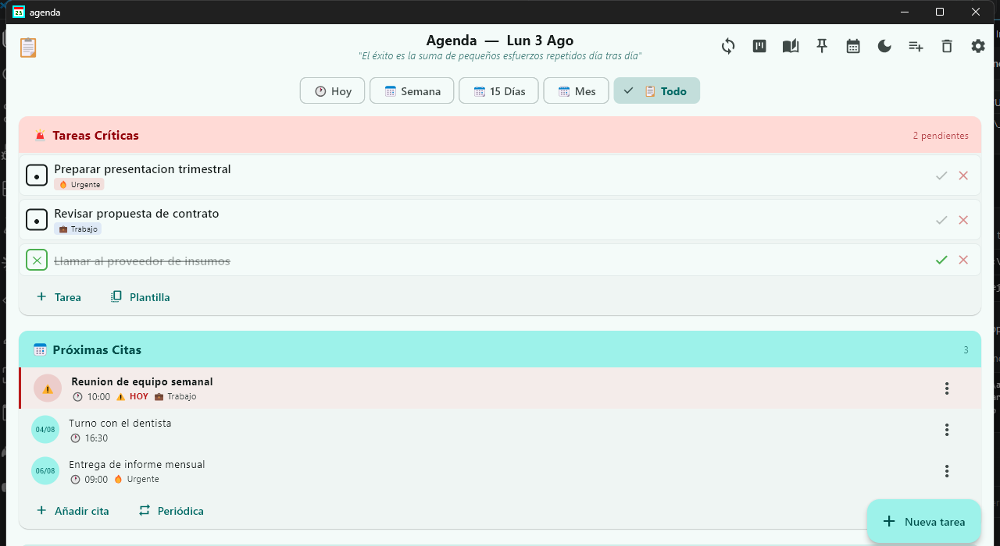
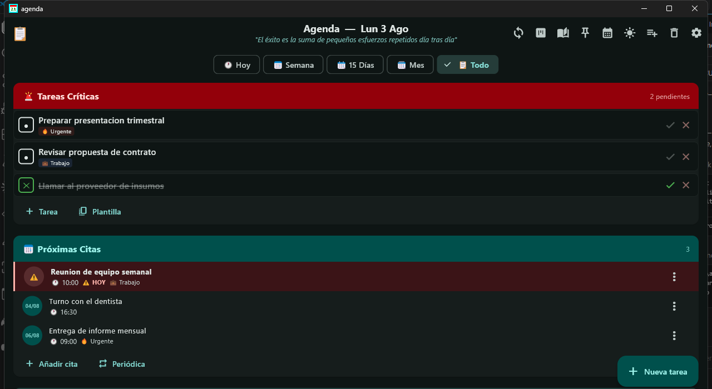

<div align="center">

[Español](README.md) · [English](README.en.md) · [Русский](README.ru.md) · **[中文](README.zh.md)**

# 📋 Agenda

使用 Flutter 构建的跨平台个人日程应用：日历、看板任务、笔记、书签、加密密码、番茄钟、模板，并通过私有 GitHub Gist 实现多设备同步。

<!-- 发布前请将 linuxesdios 替换为你的 GitHub 用户名/组织名 -->
[](LICENSE)
[](https://github.com/linuxesdios/agenda/actions/workflows/release.yml)
[](https://flutter.dev)
[](#-从源代码构建)

</div>

## 🖼️ 截图

<p align="center">
  
  
</p>

> 图中数据均为通用示例数据 — 本仓库中的任何截图都不包含真实用户数据。

## ✨ 功能

- 📅 日历与每周日程视图
- ✅ 看板式任务管理，支持优先级和提醒
- 📝 快速笔记（"随想记录"）
- 🔖 书签 / 已保存链接
- 🔐 加密密码管理器（`cryptography`）
- 🍅 番茄钟计时器
- 🧩 模板与自定义列表
- ☁️ 通过私有 GitHub Gist 实现多设备同步
- 🔔 本地定时通知
- 🖥️ Android 主屏幕小组件（自带深色模式）
- 🌗 深色模式、配色方案和语言均可自定义
- 🌍 界面支持西班牙语、英语、俄语和中文

## 📂 项目结构

这是一个单一的 Flutter 项目：应用的全部代码都在 [lib/](lib/) 中，并使用 Flutter 自身生成的标准文件夹（`android/`、`ios/`、`linux/`、`macos/`、`web/`、`windows/`）为每个平台编译。这些并不是独立的子项目 —— 它们共享 100% 的逻辑和界面代码。

```
lib/
├── main.dart          # 启动、主题、窗口生命周期
├── i18n/               # 翻译字典和语言辅助工具
├── modelos/           # 数据模型（Cita、Tarea、Configuracion 等）
├── estado/            # 应用全局状态（Provider/ChangeNotifier）
├── repositorios/      # 数据持久化（SQLite 和 JSON）及其共用接口
├── servicios/         # 通知、加密、Android 小组件、云同步
├── pantallas/         # 主要界面
└── widgets/           # 可复用组件和对话框

android/ ios/ linux/ macos/ web/ windows/   # Flutter 生成的原生工程
installer/             # 用于 Windows 安装包的 Inno Setup 脚本
```

## 🔨 从源代码构建

通用要求：[Flutter SDK](https://docs.flutter.dev/get-started/install) ≥ 3.12（已加入 PATH），并在仓库根目录执行一次 `flutter pub get`。

```bash
git clone https://github.com/linuxesdios/agenda.git
cd agenda
flutter pub get
```

### Windows

需要安装 Visual Studio 2022，并勾选 **"使用 C++ 的桌面开发"** 工作负载。

```powershell
flutter build windows --release
```

产物：`build\windows\x64\runner\Release\agenda.exe`（以及同目录下所需的 DLL 文件）。

生成 `.exe` 安装包（需要 [Inno Setup](https://jrsoftware.org/isinfo.php) 6 或更高版本）：

```powershell
"C:\Program Files\Inno Setup 7\ISCC.exe" installer\agenda_setup.iss
```

产物：`installer\Output\AgendaSetup.exe`。

### Android

需要 Android SDK（通过 Android Studio 安装），并配置好 `flutter.sdk` / `sdk.dir`（Flutter 会在首次构建时自动生成 `android/local.properties`；该文件仅限本机使用，不纳入版本控制）。

```bash
flutter build apk --release
```

产物：`build/app/outputs/flutter-apk/app-release.apk`。

### Linux

需要 GTK 3 开发依赖（`libgtk-3-dev`、`cmake`、`ninja-build`、`clang`）。

```bash
flutter build linux --release
```

产物：`build/linux/x64/release/bundle/`（完整文件夹；`agenda` 为可执行文件）。

### macOS / iOS / Web

`macos/`、`ios/` 和 `web/` 文件夹已存在（由 Flutter 生成），但本项目并未定期构建或测试它们。理论上标准命令（`flutter build macos`、`flutter build ios`、`flutter build web`）应该可以工作，但不保证 —— 如遇到问题，欢迎提交 issue/PR。

## ⬇️ 下载已编译版本

无需自行构建：每个 [Release](https://github.com/linuxesdios/agenda/releases) 都附带由 CI 自动构建好的二进制文件。

| 平台 | 下载文件 | 说明 |
|---|---|---|
| 🪟 Windows | `AgendaSetup.exe` | 安装包（推荐）—— 自动创建快捷方式和卸载程序 |
| 🪟 Windows | `agenda-windows-portable.zip` | 便携版文件夹，无需安装 —— 解压后运行 `agenda.exe` |
| 🤖 Android | `app-release.apk` | 在手机上开启"未知来源"权限后安装 |
| 🐧 Linux | `agenda-linux-x64.tar.gz` | 便携版打包（best-effort，见下方说明）—— 解压后运行 `agenda` |

### 发布新版本

```bash
git tag v1.0.0
git push origin v1.0.0
```

这会触发 `.github/workflows/release.yml`，自动编译全部 3 个平台，并将二进制文件附加发布到 Release。也可以在 **Actions → Build & Release → Run workflow** 标签页手动运行（不会发布 Release，只会保留构建产物用于验证构建是否成功）。

> **注意：** Linux 任务运行在 `ubuntu-latest` 上，但从未在本地测试过（开发所用的机器上没有 Linux 环境）。该任务标记为 `continue-on-error`，因此即使失败也不会阻塞 Windows/Android 的发布 —— 但在第一次真实运行之前，无法保证它一定能成功。

## ☁️ 设备间同步

应用使用 GitHub 上的私有 **[Gist](https://docs.github.com/en/get-started/writing-on-github/editing-and-sharing-content-with-gists/creating-gists)** 作为存储，在你的设备（公司电脑、家里电脑、手机等）之间同步数据 —— 没有自建后端或服务器：它只是你 GitHub 账户中的一个私有文本文件，应用负责读写它。

### 如何决定哪个版本生效

每次同步时（应用启动时、有变更时每 15 分钟一次，或手动点击 🔄 按钮），应用会比较时间戳，而不是盲目覆盖数据：

- **如果本地没有未同步的更改** → 只进行*读取*：如果云端有比上次同步更新的数据，就将其拉取下来。
- **如果本地有未同步的更改** → 会比较你的更改时间与云端数据的时间，**时间较新的一方生效**：如果你的更改更新，就会上传；如果云端有更晚的更改（例如从其他设备上传的），则你的本地更改会被丢弃，转而拉取云端版本。

关闭应用时，你正在编辑的内容会直接上传（不做比较），因为在那一刻它本来就是你最新的版本。

> 这套机制覆盖了正常使用场景（一次只在一台设备上编辑，切换设备时再同步）。对于两台设备同时编辑且中途未同步这种极少见的情况，并没有"解决冲突"的界面 —— 此时会静默地由时间戳较新的一方生效。

### 配置同步（每台设备只需一次）

1. **注册 GitHub 账号**（如果还没有的话）：[github.com/join](https://github.com/join)（免费）。
2. **生成一个仅限于 Gists 权限的访问令牌**：
   - 打开 [github.com/settings/tokens?type=beta](https://github.com/settings/tokens?type=beta)
   - 点击 **Generate new token** → 起个名字，例如 "Agenda"
   - 在 **Account permissions** 中找到 **Gists**，设置为 **Read and Write**
   - 生成令牌并复制（以 `github_pat_...` 开头）—— GitHub 只会显示一次
3. **在应用中**，进入"设置 → 同步"，粘贴令牌，然后点击 **"创建 gist"**（会自动创建私有 Gist 并填好 Gist ID）。
4. **在其他设备上**，重复第 3 步，但改用 **"导入"** 而不是新建：在第一台设备上点击 **"导出"**（将令牌和 Gist ID 复制到剪贴板），然后在新设备上用 **"导入"** 粘贴 —— 这样所有设备就会指向同一个 Gist。

令牌只会保存在每台设备本地（绝不会被提交到代码仓库或分享出去）；Gist 是私有的，只有你用自己的 GitHub 账户才能看到。

## 🌍 语言

应用会在首次启动时检测系统语言，也可以在"设置 → 外观"中手动更改。支持的语言：西班牙语、英语、俄语、中文。

## 📄 许可证

本项目基于 [MIT](LICENSE) 许可证发布。
